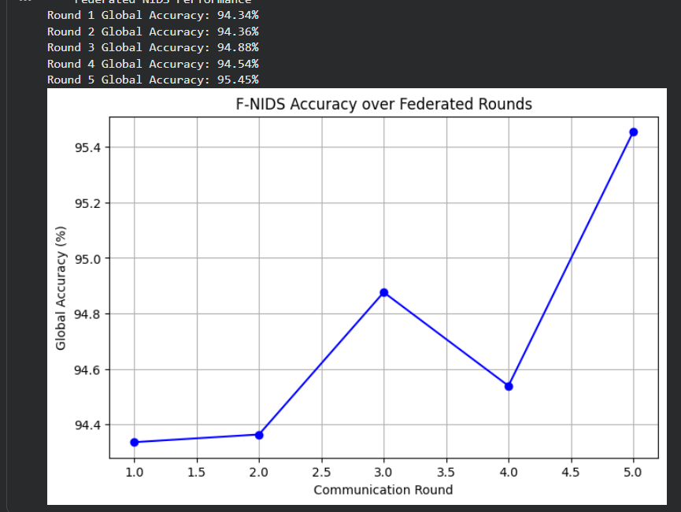

#  Federated Network Intrusion Detection System (F-NIDS)

##  Project Overview
This project implements a decentralized intrusion detection system using **Federated Learning (FL)**. Using the **Flower (flwr)** framework and **Scikit-Learn**, a global model is trained collaboratively across multiple nodes without requiring raw network data to be shared.

---

## The Core Challenge
In modern cybersecurity, organizations face a critical dilemma:

- **The Need for Intelligence:** Detecting advanced attacks requires large-scale data and collaborative learning  
- **The Constraint of Privacy:** Raw network traffic contains sensitive information that cannot be shared  

> This project bridges that gap using federated learning.

---

##  Dataset: CICIDS2017
A widely used benchmark dataset for intrusion detection research.

- **Size:** ~2.5 million records  
- **Features:** 50+ network traffic features (Flow Duration, Packet Size, etc.)  
- **Classes:** DoS, PortScan, Bot, Brute Force, and more  

---

##  Technical Implementation

###  Core Stack
- **Framework:** Flower (flwr)  
- **Model:** Multinomial Logistic Regression  
- **Aggregation:** Federated Averaging (FedAvg)  

###  Data Handling
- **Partitioning:** Horizontal split across 3 simulated clients  
- **Preprocessing:**
  - Label Encoding (targets)
  - MinMax Scaling (features)

---

##  Results

The model demonstrated stable convergence across federated rounds:

|  Round |  Global Accuracy (%) |
|--------|----------------------|
| 1      | 94.34               |
| 2      | 94.36               |
| 3      | 94.88               |
| 4      | 94.54               |
| 5      | **95.45**           |

  

---

##  Convergence Insights

- **Overall Improvement:** +1.11% increase across rounds  
- **Non-IID Effect:** Temporary dip in Round 4 due to heterogeneous client data  
- **Recovery:** Strong convergence in final round  

---

##  Key Insights

- **Federated Learning Works:** Enables collaborative intrusion detection without centralizing data  
- **Data Distribution Matters:** Non-IID client data introduces fluctuations in training  
- **Efficiency:** Logistic regression provides a strong baseline for tabular data  

---

##  Limitations

- Evaluation performed on local client data (may overestimate performance)  
- No strict train/test split per client  
- Potential class imbalance effects  

---

##  Future Work

-  Implement proper train/test separation  
-  Compare federated vs centralized vs local models  
-  Explore neural network architectures  
-  Add privacy enhancements (secure aggregation, differential privacy)  
-  Scale to real-world distributed environments  

---

##  System Architecture

###  Components

**Server (Coordinator)**
- Initializes global model  
- Aggregates client updates (FedAvg)  
- Distributes updated model  

**Clients (Local Nodes)**
- Train on private network data  
- Update local model  
- Share only model parameters  

---

### Federated Learning Loop
Global Model
↓
Clients (Local Training)
↓
Updated Weights
↓
Server Aggregation
↓
New Global Model

---

## Privacy Design

-  Raw data never leaves client nodes  
-  Only model weights are exchanged  
-  Reduces risk of sensitive data exposure  

---

## Author

**OLUSESAN AYOMIDE**
